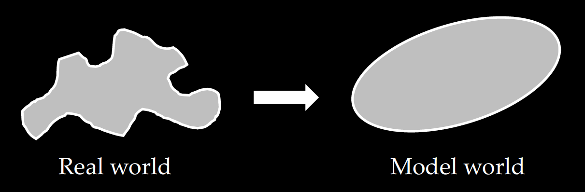

# Introduction

These course notes will introduce the mathematical tools and techniques to model and analyze linear time-invariant dynamical systems.
The concepts covered in this course provide the basis for a rich history of techniques that are ubiquitous throughout science and engineering, including but not limited to aeronautics and astronautics, electrical and communications engineering, synthetic biology, seismology, finance, robotics, and data science / machine learning.


In the context of aerospace engineering, linear analysis provides a powerful framework for modeling and analyzing dynamical systems (more on what dynamical systems are later).
The ability to model systems and analyze their properties provide engineers with the insights and predictions on how a system may behave over time and how it may respond to external inputs (e.g., disturbances, vibrations). It is with these models and insights that enable engineers to design more performant and robust solutions. Without such models and analysis techniques, the presence of vibrations and other external disturbances can, for example, lead to structural failures in components and equipment, and render guidance and navigation systems unstable.

We will begin with the definition of what a "model" means in an engineering context, and then work our way to the concept of a *linear time invariant dynamical system*.

## What is a model?

Real-world phenomena are complex. From weather patterns, fluid flow, motion of an aircraft, heat flow, animal population, spread of diseases, etc. There are many factors that influence the behavior, all the way from the atomic level, to the gravitational pull of the moon. So how does one go about describing these phenomena and analyzing them?

Well, we need a **model**! Simply put, a model is a mathematical representation of a phenomenon that you wish to describe.
A model should be:
- **Descriptive**: Provide information about the key attributes of interest
- **Predictive**: Describe how the attributes behave over time and space


Models are essential to the engineering design process: as engineers, we rely on models to explain and predict the behavior of a system, to iterate upon designs more quickly (e.g. by using computer simulation), and to leverage the tools of mathematical analysis to inform design, specification, and experimentation. Inversely, we may also wish to compress data gathered from experiments into a model which may otherwise be difficult to specify from first-order principles (This process is called *system identification*, and will be briefly introduced near the end of the course). Models are also necessary for *decision-making and control*, i.e. manipulating real-time inputs to a system in order to produce some desired behavior.

With a model, we can answer questions like
- Is there some underlying structure or patterns in how the phenomena evolves?
- How sensitive is the behavior to changes to the environment (i.e., disturbances)?
- Does the behavior evolve in an unbounded or chaotic way?
- How responsive is the behavior?
- Does the behavior eventually settle to some equilibrium condition?

But as mentioned above, real-world phenomena are complex! Accurately describing every minute detail of a phenomenon would be impossible! There are many things in the real-world that are very difficult to explain and/or is just inherently random. So is coming up with a model a lost cause? Well...no. Accepting the fact that we cannot completely describe every minute detail of the phenomenon, we need to decide when a model is "good enough" for whatever engineering design problem you are working on. In other words, we need to decide on what is an appropriate level of abstraction.

But deciding what level of abstraction is appropriate for your particular engineering task can be hard. You need to think about why you want to haver a model in the first place. For example, if you are designing a control system for a high-precision tracking task (e.g., controling a laser), then you may want to have have a very accurate model. Or if you are doing some rough calculations to help you sketch out some preliminary designs for an aircraft wing, you may want to start with a rough model at first.

Below is an illustration of what it means to abstract away the finer details of the real-world and come up with a mathematical model to describe the relevant features of the phenomenon.



Ultimately, the thing to note is that "all models are wrong, but some are useful" -- George Box.
This quote emphasizes the idea that while no model can perfectly capture the complexities of reality, a well-constructed model can still provide valuable insights and predictions.


## Dynamical systems
So far, we have used the term "system" and "phenomena" somewhat interchangeably. Let's get a little more concrete as to what we mean by that.
Suppose there is a phenomenon we wish to model. By phenomenon, it could be things like the motion of an aircraft, the population of wolves and rabbits in a forest, the bending of an aircraft wing during flight. Within this phenomenon, there is a set of pertinent quantities, or variables, that describe the key properties. We refer to these pertinent quantities as the **state**, a minimal set of variables needed to describe the phenomenon at any given time $t$. The state is often denoted by a vector $\mathbf{x}(t)\in\mathbb{R}^n$.

There are also quantities, or variables, that are not part of the state but still affects the behavior of the system.
There can be inputs into the system whose values can be selected by a user. These are referred to as **control inputs**, and often denoted by $\mathbf{u}(t)\in\mathbb{R}^m$.
There are also inputs into the system whose values is not determined by a user, but rather, due to some external uncontrolled factors from the environment. These are referred to as **disturbance inputs**, and often denoted by $\mathbf{d}(t)\in\mathbb{R}^p$.

**Example:** Motion of an aircraft. The states are position, velocities, orientation and orientation rates, the control inputs are the flaps on the elevator, rudder, and ailerons, and disturbance inputs can be due to wind gusts.

**Example:** Population of wolves and rabbits in a forest. The state can be the number of wolves and rabbits, the control inputs are how many trees are cut down/planted, and disturbance inputs can be the climate (e.g., flood, drought, snow).

Now, notice that the values of the state evolve over time. In fact, at time $t$, the rate of change of the state $\dot{\mathbf{x}}(t)$ depends on the current state $\mathbf{x}(t)$, control $\mathbf{u}(t)$, and disturbance $\mathbf{d}(t)$.
As such, we can describe the time evolution of the state as  *first-order* ordinary differential equation where $f$ is a function describing the **dynamics** of the system:


```{math}
:label: eq-ch1-dynamics

\dot{\mathbf{x}}(t) = f(\mathbf{x}(t), \mathbf{u}(t), \mathbf{d}(t), t).
```

<!-- {eq}`cs_14` -->


Collectively, we refer to the dynamics (i.e., first-order ODE), state, control, and disturbance as a **dynamical system**.

Essentially, we have a first-order ODE. To compute the state at any time in the future given the current (initial) state, we can simply integrate the dynamics.


```{math}
:label: eq-ch1-dynamics-solution
\mathbf{x}(t_f) = \mathbf{x}(t_0)  + \int_{t_0}^{t_f} f(\mathbf{x}(\tau), \mathbf{u}(\tau), \mathbf{d}(\tau), \tau) d\tau
```


```{exercise}
:label: ch1-dynamics
List other examples of dynamical systems.
```

## Taxonomy of dynamical sytems
We have just described what a dynamical system is, and we can see that dynamical systems are everywhere, from chemistry, biology, ecology, finance, engineering, etc. Let's now focus more on dynamical systems in the context of aerospace engineering. In aerospace engineering, we will come across many *physical* systems (e.g., rigid bodies, structures, aircraft) that are governed by *physics* where the motion of objects are due to forces and moments. In other words, we are interested in *mechanical dynamical systems* which are systems that are governed by Newton's 2nd law of motion, $\Sigma F=m\ddot{x}$.

**Example: ** (TODO) Mass-spring-damper system.

Even though we are restricting our study to mechanical dynamical systems, there still can be many different classes of dynamical systems. Let's take a look at the following taxonomy.

**TODO: Add diagram of taxonomy**

- **Infinite vs finite dimensional**: This refers to the size of the state vector. If there are a finite number of quantities we care about, then this is obviously a finite dimensional problem, e.g., position and orientation of an aircraft. Alternatively, if we are considering, say fluid flow or a continuous beam structure, then there are *infinite* number of molecules that we want to model. The latter typically results in a partial differential equation, but practically, these infinite dimensional problems are often broken down into a finite, albeit many, components, turning an infinite-dimensional problem into a finite one. This is essentially what happens in computational fluid dynamics (CFD) and finite element analysis (FEA). In this course, we are interested in **finite-dimensional** dynamical systems.

- **Linear vs nonlinear**: The dynamics function $f$ can be linear or nonlinear with respect to its input arguments. Linear dynamical systems are nice because they have nice and predictable properties, and we are able to leverage techniques from linear algebra. While nonlinear dynamics are harder to analyze and each type of nonlinear is unique. That is, techniques for a type of nonlinearity does not typically transfer to a different type of nonlinearity. In this course, we are interested in **linear** dynamical systems.

- **Time-invariant vs time-varying**: Not only do the dynamics depend on state, control and disturbances, but it can also depend on time. Meaning the dynamics of the system may change depending on the time of day it is even though the initial conditions may be the same. For example, traffic flow is different during peak hours than it is during the middle of the night. Naturally, working with time-varying dynamics is more challenging. In this course, we are interested in **time-invariant** dynamical systems.

The focus on **linear time-invariant (LTI) dynamical systems** may seem restrictive.
In fact, one could argue that nothing in the real-world truly an LTI system. So why do we even bother studying LTI systems? Well, it's because we can actually solve them! With the power of linear algebra, we can actually model, analyze, and perform computation with LTI systems.

It turns out that the theory developed for linear analysis works quite well in practice, even for analyzing and controlling systems with nonlinear dynamics. In particular, by computing the 1st-order Taylor expansion (i.e., the *linearization* of a nonlinear system at an operating point), it is possible to apply the tools of linear analysis to local neighborhoods of nonlinear systems. In fact, iteratively repeating this process in a *feedback loop* forms the basis of many modern control techniques.
Similarly, the richness of linear system theory provides promising practical directions for structural design as well: by building systems that have structural properties that closely approximate linear systems, engineers can build systems that are easier to control.


